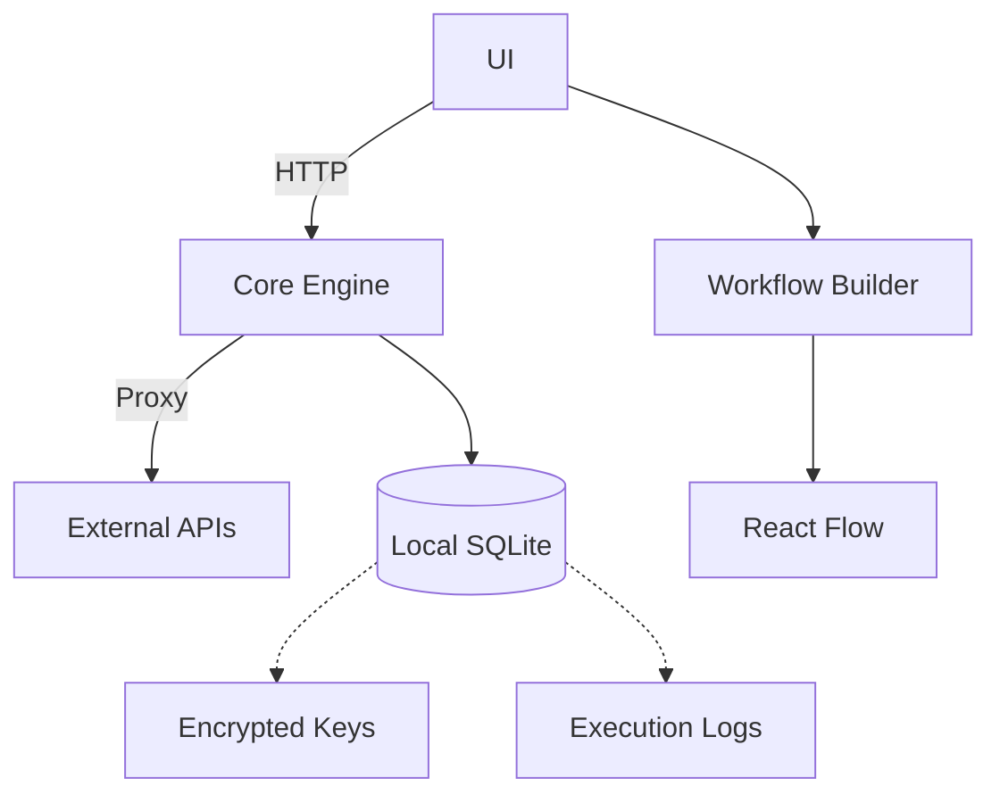

# ZenFlux ⚡🧘

**Open-Source Workflow Automation with Zen-Simplicity and Cost Transparency**

[](https://opensource.org/licenses/MIT)
[](https://bun.sh)


## Features ✨

**Local-First Automation**
- 🛡️ 100% local execution - your data never leaves your machine
- 🔑 Encrypted API key vault with Windows Credential Manager integration
- 📊 Real-time cost tracking for external APIs

**Enterprise-Grade Workflows**
- 🎨 Intuitive drag-and-drop interface
- 🔄 Hybrid execution (local + cloud ready)
- 📈 Token-based cost estimation (OpenAI, Stripe, etc.)

**Zen-Inspired Design**
- 🌓 Automatic light/dark mode
- 🌈 Calming yet energetic visual language
- 🧠 Intuitive node-based interface

## Installation 💻

**Prerequisites**
- Windows 10/11
- PowerShell 7+
- [Bun Runtime](https://bun.sh)

```powershell
# Clone repository
git clone https://github.com/yourusername/zenflux.git
cd zenflux

# Install dependencies
bun install

# Start development mode
bun run dev
```

## Design System 🎨

### Color Palette

#### Light Mode

| Role       | Hex       | Preview | Use Cases |
|------------|-----------|---------|-----------|
| Primary    | `#5AC8D8` | $${\color{#5AC8D8}████████}$$ | Buttons, Primary Actions, Key UI Elements |
| Secondary  | `#FF6B6B` | $${\color{#FF6B6B}████████}$$ | Alerts, Warnings, Error States |
| Background | `#F9FBFD` | $${\color{#F9FBFD}████████}$$ | Page Background, Content Areas |
| Accent     | `#A66EFA` | $${\color{#A66EFA}████████}$$ | Highlights, Icons, Decorative Elements |

#### Dark Mode

| Role       | Hex       | Preview | Use Cases |
|------------|-----------|---------|-----------|
| Primary    | `#4ECDC4` | $${\color{#4ECDC4}████████}$$ | Buttons, Primary Actions, Key UI Elements |
| Secondary  | `#FF7E67` | $${\color{#FF7E67}████████}$$ | Alerts, Warnings, Error States |
| Background | `#1A1E26` | $${\color{#1A1E26}████████}$$ | Page Background, Content Areas |
| Accent     | `#9D7AFF` | $${\color{#9D7AFF}████████}$$ | Highlights, Icons, Decorative Elements |


## Architecture 📐


## Roadmap 🗺️
| Status  | Feature                  | Description                          |
|---------|--------------------------|--------------------------------------|
| ✅ Done | Core Proxy Engine        | API routing with cost tracking       |
| 🚧 WIP  | Workflow Builder UI      | Drag-and-drop interface              |
| ⏳ Next | API Key Vault            | Secure credential storage            |
| 🔜 Soon | Hybrid Execution         | Local + cloud task distribution      |

## Contributing 🤝
We welcome contributions aligned with our design principles:
1. Follow the [ZenFlux Color System](#design-system)
2. Maintain 100% local execution for core features
3. Prioritize transparency in API cost calculations

**Tech Stack**
- Frontend: React + TypeScript + React Flow
- Backend: Bun + Express + SQLite
- Tooling: Vite + PowerShell scripts (give functionality to macos and linux in the future)

## License 📄
MIT License - See [LICENSE](LICENSE) for details

---

**Breathe easy while building automations**  
"Simplicity is the ultimate sophistication" - Adapted from da Vinci


